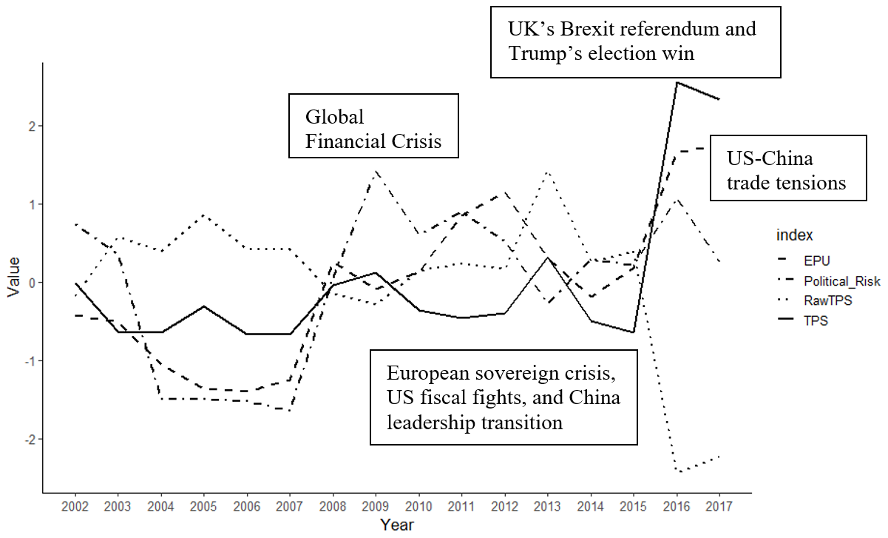

# Trade Policy Sensitivity (TPS)

**Code & Data Appendix** for _“Trade Policy Uncertainty and Global Stock Returns: Evidence from the 2016 US Presidential Election”_

_This version: 2024/11/29_

This is code appendix to construct and analyze the project. It required data from **data** folder. In the folder, we have these code files:

## Part 1: To construct data: using R programming
1.	**01_construct_tps_panel.qmd**: to construct panel data of TPS from 2002-2017. 
-	Part 1.1: This file will rolling estimate the TPS by using the previous 10 years of data. Also, it also constructs alternative TPS using the previous 1 to 5 years of data.
-	Part 1.2: It also provides several tests to compare the TPS (using previous 10 years of data) with other existing uncertainty indices such as TPS or political risk.
2.	**02_construct_abnormal_returns.qmd**: to construct abnormal returns. We have 3 different pricing models: CAPM, Dimson 1979, and FF3. Each model will have raw or excess returns (after minus risk-free rate). Totally, we have 6 alternative measure of abnormal returns. We will use CAPM with raw return as the main result. Other specifications are in robustness checks and will be used in t6_alter_CARs.do.
3.	**03_construct_trump_regdata.qmd**: to construct Trump’s event regression data by merging between TPS, abnormal returns, and control data.

## Part 2: To analyze the Trump 2016 event study: using Stata programming
4.	**main.do**: run regressions to use Trump 2016 election as the event and analyze if firms with high TPS will have a more negative returns. This file will call and run several below tests:
-	**t1_bystats.do** and **t2_summary_stats.do**: Summary Statistics and univariate t-tests by groups.
-	**t3_main.do**: Main regressions
-	**t4_more_country_controls.do**: Control for other policies
-	**t5_longterm.do**: Long-term performance to one year
-	**t6_alter_CARs.do**: Robustness for alternative CAR specification. It will run five t6sub files for five alternative specifications.
-	**t7_alterTPS.do**: Robustness for alternative TPS specification
-	**t_excludeChina.do**: Exclude China and only-China sample
-	**t_positive_vs_negativeTPS.do**: Positive versus negative TPS

After running these codes, the results will be in **output** folder.

## Data
In the `data` folder, we also provide final data of the study:
- tps_ts.csv: Time series of the TPS average across firms. This data is created from **01_construct_tps_panel.qmd**
- tps_evtstudy_2016.dta: The event-study cross-sectional data for the 2016 Trump election. This data is created using file **t3_main.do**
